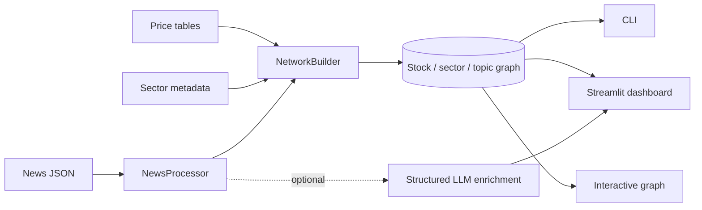

# Stock and News Network Explorer

A graph-based market research application that connects stocks, sectors, and
news topics. It supports local data ingestion, correlation-based graph
construction, shortest-path and centrality analysis, interactive Streamlit
views, and optional structured LLM enrichment.

> Portfolio note: the repository ships with a tiny **synthetic** dataset for a
> deterministic demo. It contains no vendor data and must not be used for
> investment decisions.

## What this demonstrates

- A reproducible pipeline from raw tables to a heterogeneous NetworkX graph
- Explicit comparison of correlation-threshold and top-k sparsification
- Configurable topic exposure weights (`article_count` or relevance metrics)
- Separate offline enrichment and one-article online LLM workflows
- CLI and Streamlit interfaces backed by the same analysis layer
- Automated tests for loaders, graph construction, analysis, and UI helpers



## Quick start

Requires Python 3.10+.

```bash
python -m venv .venv
source .venv/bin/activate
python -m pip install -r requirements.txt
streamlit run query_app.py
```

The default app reads `data/demo`, which contains three fictitious price
series and four fictitious articles using familiar ticker labels. No API key is
needed for this path.

Run the command-line explorer:

```bash
python main.py --tickers AAPL,MSFT,NVDA --top-k 1
```

## Use your own local data

Keep downloaded data outside the tracked demo directory:

```bash
export MARKET_EXPLORER_DATA_DIR=data/local
export ALPHA_VANTAGE_API_KEY=your_key_here
python seed_data.py --tickers AAPL,MSFT,NVDA --news-tickers AAPL,MSFT,NVDA
streamlit run query_app.py
```

`data/local/` is ignored by Git. Review the provider's terms before downloading,
storing, or sharing any data. See [DATA_SOURCES.md](DATA_SOURCES.md).

The live article-impact feature also accepts `OPENAI_API_KEY`. Keys must remain
in environment variables or an untracked `.streamlit/secrets.toml` file.

## Key design choices

- **Threshold mode** is an interpretable baseline; **top-k mode** gives tighter
  control over graph density.
- Topic nodes summarize article-level observations, keeping the graph readable.
- Historical LLM output is generated offline for auditability; the online path
  handles one user-supplied article at a time.
- LLM output is treated as an uncertain annotation, never a return forecast.

The original experiment record is preserved in
[docs/EXPERIMENTS.md](docs/EXPERIMENTS.md). Its metrics describe one historical
dataset and are not claimed as current production performance.

## Project structure

```text
config.py                    environment and data-path configuration
data_loader.py               provider download adapters
news_processor.py            normalized article/topic/ticker tables
network_builder.py           heterogeneous graph construction
network_analyzer.py          graph queries and centrality metrics
llm_enricher.py              optional structured offline enrichment
streamlit_app.py             analysis dashboard
interactive_graph_app.py     interactive graph workspace
tests/                       unit and integration-style tests
data/demo/                   synthetic, redistribution-safe demo data
```

## Verification

```bash
python -m compileall -q .
pytest -q
```

CI runs those checks on supported Python versions. Historical local results are
not a guarantee that every future dependency release will behave identically.

## Limitations

- Correlation is descriptive, unstable across windows, and non-causal.
- Topic exposure depends on upstream article coverage and tagging quality.
- The demo is intentionally too small for substantive market conclusions.
- External HTML and LLM text should be treated as untrusted input.
- This software is research tooling, not an investment recommendation system.

## License

Code is released under the MIT License. Data and third-party services retain
their own terms and licenses.
